# WoWiki

WoWiki is a modular World of Warcraft Classic platform built with a React frontend, a NestJS content and game-data API, ASP.NET Core services, and a YARP gateway. User content reports are delivered to the [TaskForge](https://github.com/Arvence/TaskForge) background job processor over a private server-to-server integration.

## Local architecture

The browser uses one origin: `http://localhost:8080`.

[](docs/request-response-map.md)

| Public path | Destination |
| --- | --- |
| `/` | React frontend on port `3000` |
| `/api/auth/*` | Auth service on port `5100` |
| `/api/pdf/*` | PDF service on port `5200` |
| `/api/*` | NestJS backend on port `5000` |
| `/images/*` | NestJS backend on port `5000` |
| `/gateway/health` | Gateway health |

The frontend only uses relative application URLs. Internal ports remain implementation details behind the gateway.
Protected NestJS operations forward the session cookie and correlation ID to the Auth service;
the gateway-forwarded client address keeps authentication limits partitioned per browser.
Mutable backend content and game data persist in `backend/Data/wowiki-backend.db`;
the Auth service keeps identity data in its separate SQLite database.

See the [gateway-first request/response map](docs/request-response-map.md) for
end-to-end flows, endpoint access levels, propagated headers, response shapes,
and service ownership.

## Run locally

Start each component in a separate terminal:

```powershell
cd backend
npm run dev
```

```powershell
cd frontend
npm run dev
```

```powershell
cd services/auth
dotnet run --project src/WoWiki.Auth.Api
```

```powershell
cd services/pdf
dotnet run --project src/WoWiki.Pdf.Api
```

```powershell
cd services/gateway
dotnet run --project src/WoWiki.Gateway
```

Open `http://localhost:8080`.

TaskForge is optional for general browsing but required for asynchronous
user-report delivery. Run TaskForge separately on its default
`http://localhost:8275` address before testing the report workflow. See
[TaskForge user-report integration](docs/taskforge-user-reports.md) for the
network boundary and configuration.

## Repository structure

```text
frontend/          React user interface
backend/           NestJS content and canonical game-data API
services/auth/     ASP.NET Core identity service
services/pdf/      ASP.NET Core PDF generation service
services/gateway/  YARP public entry point and request routing
```

The gateway is the required browser entry point. Vite serves frontend assets internally and does not proxy application APIs.
Gateway API routes include per-client rate limiting, correlation IDs, baseline security headers, request hardening, and structured request logging.
Content and game-data reads are public. Mutations require an authenticated moderator or admin,
while community creation, comments, and reactions require an authenticated user.
