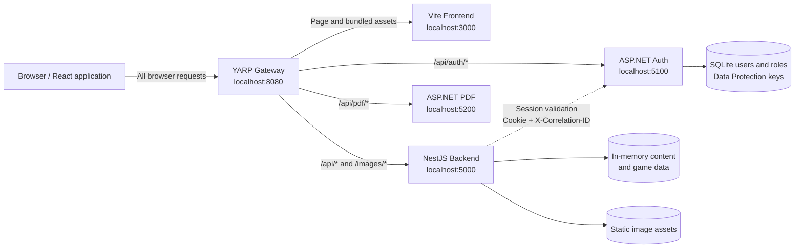
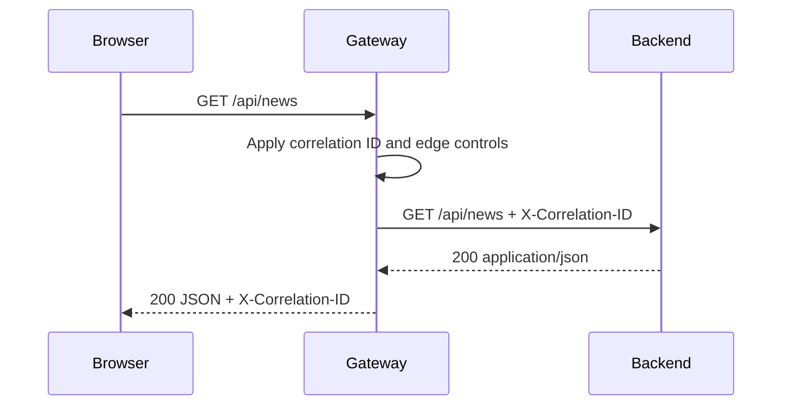
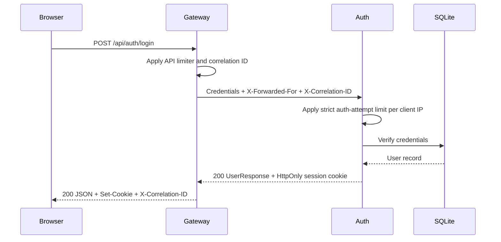
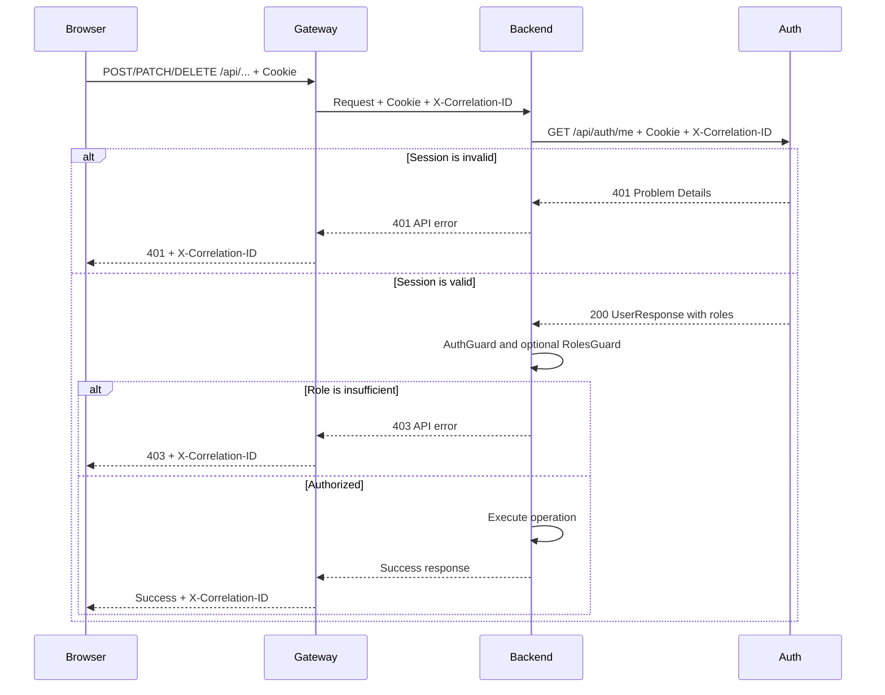
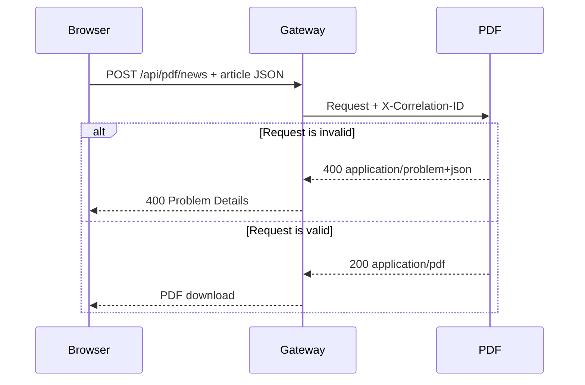

# WoWiki gateway-first request/response map

This document describes the current request paths, response paths, authorization
boundaries, and service ownership in WoWiki.

## System map



The browser has one origin: `http://localhost:8080`. It does not need to know
the internal service ports.

## Gateway routing

Routes are matched from the most specific path to the catch-all frontend route.

| Public request | Gateway destination | Edge rate limit | Purpose |
| --- | --- | --- | --- |
| `GET /gateway/health` | Gateway | No | Gateway health |
| `/api/auth/*` | Auth `:5100` | Yes | Registration, sessions, and profiles |
| `/api/pdf/*` | PDF `:5200` | Yes | PDF generation |
| `/api/*` | Backend `:5000` | Yes | Content and game-data API |
| `/images/*` | Backend `:5000` | No | Static backend images |
| Everything else | Frontend `:3000` | No | Application shell and frontend assets |

The API limiter permits 300 requests per 60-second window for each effective
client IP by default. The gateway also applies correlation IDs, baseline
security headers, structured request logging, a 10 MB request-body limit, and
two-minute upstream activity timeouts.

## Access levels

| Level | Meaning |
| --- | --- |
| Public | No session is required |
| User | A valid WoWiki session cookie is required |
| Moderator | A valid session with the `moderator` or `admin` role is required |

## Core request flows

### Public read



Public reads do not call Auth.

### Login and session creation



The browser stores the HttpOnly cookie and automatically sends it on later
requests because the shared frontend client uses `credentials: "include"`.

### Authenticated or moderator Backend operation



The Backend-to-Auth check has a three-second timeout by default. If Auth is
unavailable or times out, Backend returns `503 Service Unavailable`; it does not
silently treat the user as authorized.

### PDF generation



PDF generation is currently public and stateless. The frontend sends it through
the same shared request/error pipeline as JSON APIs.

## Endpoint ownership

### Auth service

| Method and path | Access | Success |
| --- | --- | --- |
| `POST /api/auth/register` | Public, strict attempt limit | `201` user JSON and session cookie |
| `POST /api/auth/login` | Public, strict attempt limit | `200` user JSON and session cookie |
| `POST /api/auth/logout` | User | `204` |
| `GET /api/auth/me` | User | `200` user JSON |
| `PATCH /api/auth/me` | User | `200` updated user JSON |
| `POST /api/auth/change-password` | User | `204` |
| `GET /health` | Internal | Auth and database health |

The public user response contains `id`, `email`, `displayName`, `createdAtUtc`,
and `roles`. Passwords and internal credential fields are never returned.

### Backend content API

| Resource | Public operations | User operations | Moderator operations |
| --- | --- | --- | --- |
| News | List and detail | Like/unlike | Create, update, delete |
| Community | List, detail, comments | Create entry and comment | Update and delete entry |
| Comments | Detail | Like | Update and delete |

For news, community entries, and comments, the server derives the author from
the authenticated user. The server also owns publication and update timestamps;
it does not trust those identity fields from the browser.

### Backend game-data API

| Resource | Public operations | Moderator operations |
| --- | --- | --- |
| Characters | List and detail | Create, update, delete |
| Classes | List and detail | Create, update, delete |
| Factions | List and detail | Create, update, delete |
| Dungeons | List and detail | Create, update, delete |
| Raids | List and detail | Create, update, delete |
| Items | List and detail | Create, update, delete |
| Talents | List, detail, and build validation | None |

All paths in these two Backend tables are under `/api`, for example
`GET /api/items` and `PATCH /api/items/:id`.

### PDF service

| Method and path | Access | Response |
| --- | --- | --- |
| `POST /api/pdf/news` | Public | PDF file or `400` Problem Details |
| `GET /health` | Internal | PDF service health |

The news PDF request contains `title`, `summary`, `content`, `category`,
`author`, and `updatedAt`.

## Header and cookie propagation

| Value | Path | Behavior |
| --- | --- | --- |
| `X-Correlation-ID` | Browser or Gateway → all services | Gateway accepts a valid value or generates one; services adopt it and return it |
| `X-Correlation-ID` | Backend → Auth | Preserves one ID across a protected operation and its session check |
| `Cookie` | Browser → Gateway → Auth | Creates and uses the Auth session |
| `Cookie` | Browser → Gateway → Backend → Auth | Lets Backend validate the session without owning identity data |
| `X-Forwarded-For` | Trusted proxy → Gateway → Auth | Keeps edge and login limits partitioned by the effective client |
| `X-Forwarded-Proto` | Trusted proxy → Gateway | Preserves the original scheme in a deployed proxy topology |
| `Content-Type` | Client ↔ service | JSON APIs use `application/json`; errors may use `application/problem+json`; PDF uses `application/pdf` |

Forwarded headers must only be enabled with explicitly configured trusted proxy
addresses outside local development.

## Response and error map

Typical successful responses are:

```json
{
  "id": "resource-id",
  "otherFields": "resource-specific data"
}
```

Backend errors use the NestJS-style envelope:

```json
{
  "statusCode": 400,
  "error": "Bad Request",
  "message": "Validation failed",
  "timestamp": "2026-07-25T12:00:00.000Z",
  "path": "/api/example",
  "correlationId": "0123456789abcdef0123456789abcdef"
}
```

Gateway, Auth, and PDF errors use ASP.NET Problem Details:

```json
{
  "type": "https://httpstatuses.com/429",
  "title": "Too many requests",
  "status": 429,
  "detail": "Optional detail",
  "traceId": "0123456789abcdef0123456789abcdef"
}
```

Validation failures may also contain an `errors` object. The frontend shared
HTTP client understands both error shapes and turns them into one `HttpError`.
A `429` response can include `Retry-After`.

## Service responsibilities

| Component | Owns | Does not own |
| --- | --- | --- |
| Gateway | Public entry point, routing, correlation, coarse limits, proxy trust, edge headers and logging | Business rules, user records, content, PDF layout |
| Auth | Users, password verification, session cookies, roles, fine auth-attempt limits | Content permissions beyond supplying roles |
| Backend | Content, game data, validation, resource authorization | Passwords and session storage |
| PDF | Validating PDF requests and rendering PDFs | Users, sessions, content persistence |
| Frontend | UI state, relative API calls, shared response/error handling | Trust decisions or authoritative identity fields |

This is a focused application gateway, not a general-purpose API-management
platform. That keeps it small while still giving WoWiki one secure and
observable public boundary.

## Current limits and future pressure points

- Backend content and game data are currently in memory. Persistent storage is
  needed before multi-instance Backend deployment.
- Auth rate-limit state is process-local. A distributed limiter is needed if
  several Auth instances must share one global attempt budget.
- Search currently fans out to several read endpoints. A Backend search
  aggregation endpoint becomes worthwhile if latency or request volume grows.
- The gateway has no service discovery, token transformation, billing, or
  developer-portal features. Add those only if WoWiki develops a real need for
  external API management.
- Internal service ports should remain private in deployment. Only the gateway
  should be internet-facing.

## Change checklist

When adding an endpoint:

1. Keep the browser URL relative and route it through the gateway.
2. Put the business rule in its owning service, not in the gateway.
3. Mark the endpoint Public, User, or Moderator.
4. Preserve the correlation ID on internal calls.
5. Return one of the documented error shapes.
6. Add tests at the owning service and at the gateway only when routing or edge
   behavior changes.
7. Update this map if the request path or ownership boundary changes.
